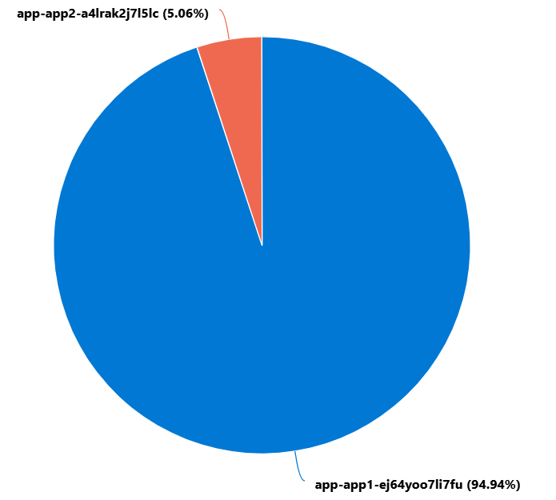

# Apim Traffic Splitting

A demonstration of using APIM for traffic splitting. This is useful when the underlying infrastructure service that APIM proxies to does not support traffic splitting or where the specific configuration of the your apps requires Azure API Management to be responsible for traffic management.

## Capability

Using an Azure API Management policy, for traffic splitting API calls based on a percentage weight.

## Implementation

Azure API Management does not come with a traffic splitting policy/algorithm. Fortunately it does leverage C# and some .NET Framework types in the policy expression engine. We can therefore use a simple Random function to randomly create a number, then allocate the traffic based off that number. All things working as they should, we have a simple but effective way of balancing load.

This can be leveraged in the following types of scenario;

- Canary (by sending a small percentage of traffic)
- Blue/Green
- Staged Migrations

## Anti pattern

Where using an Azure service that supports traffic splitting (like [App Service](https://docs.microsoft.com/en-us/azure/app-service/deploy-staging-slots#route-traffic), or [Service Mesh](https://docs.microsoft.com/en-us/azure/aks/servicemesh-about) in AKS) that should be the way to implement this capability. Where this is not possible, APIM can be used to provide this capability.
## Bicep

Bicep 'Infrastructure as Code' files are included in this repo to provide an end to end deployment of this scenario that you can run in your own subscription. The [bicep deployment](application/trafficsplitdemo.bicep) follows the App/Archetype/Foundation modular pattern that promote better modular reuse.

To read more about the bicep structure and deployment [click me](bicep.md).

## APIM Policy

An APIM policy provides the opportunity to manipulate requests that are proxied by API Management.
The policy overrides the base-url based on the comparison of the randomly generated number and the specified traffic weight split value.

The values for weight and override url are taken from [Named Values](https://docs.microsoft.com/en-us/azure/api-management/api-management-howto-properties) that are defined in the bicep files.

```xml
        <choose>
            <when condition="@(new System.Random().Next(1,100) &lt;= {{MyTrafficSplitApp_TrafficSplitWeight}})">
                <set-backend-service base-url="{{MyTrafficSplitApp_TrafficBaseUrlOverride}}" />
            </when>
        </choose>
```

The Policy is applied at the API level and would affect all API Operations defined under that API.

## Load testing

In order to test the traffic splitting we need to send a lot of traffic through APIM.
[Azure Load Testing](https://azure.microsoft.com/en-gb/services/load-testing/) provides an easy way to send bulk requests, simulated from multiple users.

> The Azure Load Testing service is not included in the bicep files as it is currently in preview with some notable limitations in automating.

To create the load test in your own subscription, use the Portal and the JMX file in this repo. Replace the value of `HTTPSampler.domain` in the XML file for the endpoint of your APIM.

## The results

The following Log Analytics query can be run to show the traffic split

```kql
AppRequests |
where SDKVersion  startswith "azurefunctions" |
summarize count() by AppRoleName |
render piechart
```

| AppRoleName | count_ |
| ----------- | ------ |
| app-app1-sqvskzhbllsbc | 68,073 |
| app-app2-oastktr32gjrw | 3,626 |



We can see that we didn't miss the mark by much. After sending over 70000 requests, we aimed to split **5%** of the traffic away and have successfully separated exactly **5.06%** of the traffic to App2.

## Further Reading

The official documentation for [APIM policy - set-backend-service](https://docs.microsoft.com/en-us/azure/api-management/api-management-transformation-policies#SetBackendService) is well worth a read.

This is a great [blog post](https://borzenin.com/apim-canary-policy/) from
Evgeny Borzenin that gives a great explanation of the Canary APIM policy. The implementation with the Policy code is a little different to this post, but i thoroughly recommend reading his blog post.


