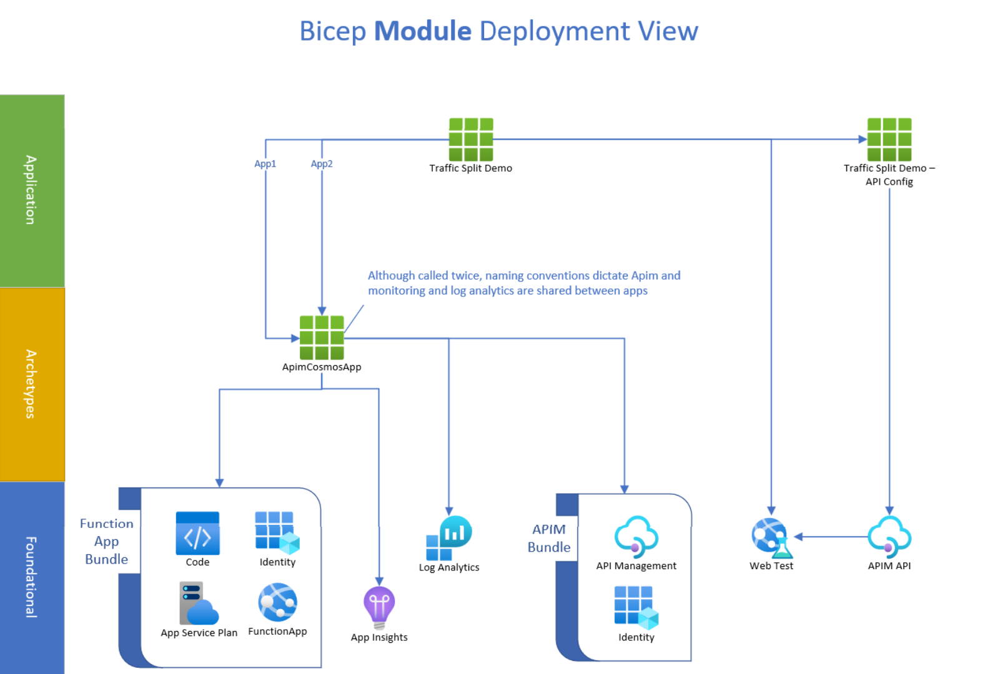

# Bicep

## One click philosophy

By encompassing all of the deployment logic within the bicep code files, complexity of the deployment is reduced.
There are no manual steps to complete, nor any scripts that have to be run after deployment.

In addition to deploying the infrastructure, the Function App code deployment is done through binding to a GitHub repository. This means after the deployment is completed, the full infrastructure and app stack is ready.

Deployment takes approximately 10 minutes.

## Primary services

The infrastructure that is created focusses on

- API Management
- 2 Function Apps with the dummy API
- App Insights to log the function App telemetry

However over 16 Azure resources are created to support the one click deployment.

## Module deployment view

